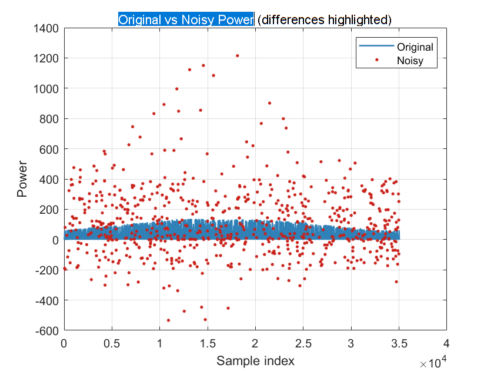
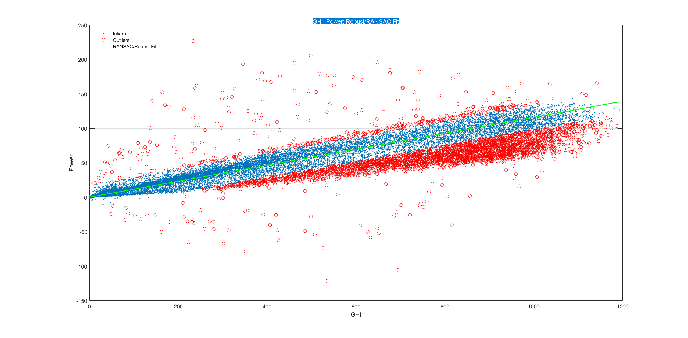
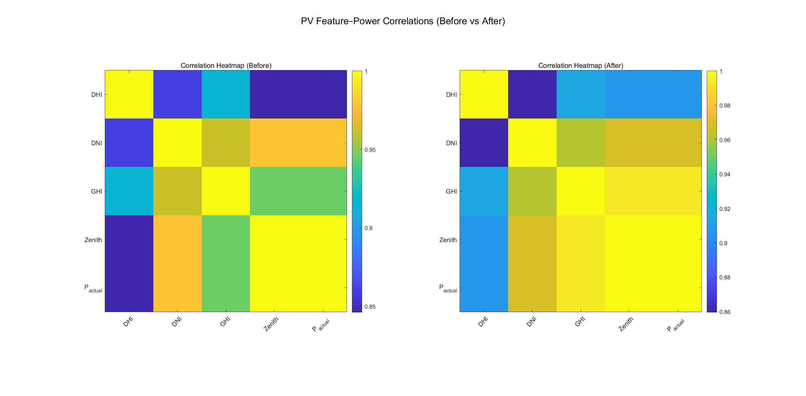

# PV-NICV
PV-NICV: Photovoltaic Noise Injection, Cleaning &amp; Validation pipeline for 2021 full-year official measured dataset (China, 15-minute resolution).

This repository provides a **complete pipeline** for handling a 15-minute resolution photovoltaic (PV) dataset, specifically the **2021 full-year dataset** (17 meteorological/irradiance features + 1 power output column).

The workflow includes:
- Noise injection (simulate real-world anomalies)  
- Cleaning & validation (robust regression, isolation forest, metrics)  
- Visualisation and evaluation  

---

## 👤 Author

**Yue Qi**  
James Watt School of Engineering, University of Glasgow
Yue.Qi@glasgow.ac.uk
---


## 📑 Data Source

The raw dataset (`2021PV15min.csv`) originates from **official on-site measurements in a certain region of China**.  
It represents one full year (2021) of 15-minute resolution PV meteorological and irradiance data with 17 features plus 1 actual power output column.  

Usage of this dataset is intended **for academic research and educational purposes only**.  
If you use this dataset, please acknowledge the source.

---
## 📂 Dataset Description

The dataset contains **18 columns**: 17 features + 1 measured power output.

| Index | Column Name                         | Description                               | Unit  |
|------:|-------------------------------------|-------------------------------------------|-------|
| 1     | Time                                | Timestamp (local time, yyyy/MM/dd HH:mm)  | -     |
| 2     | Air Temperature                     | Ambient air temperature                   | °C    |
| 3     | Azimuth Angle                       | Solar azimuth angle                       | °     |
| 4     | Cloud Opacity                       | Cloud optical opacity (0–1)               | -     |
| 5     | Dew Point Temperature               | Dew point temperature                     | °C    |
| 6     | DHI (Diffuse Horizontal Irradiance) | Diffuse horizontal irradiance             | W/m²  |
| 7     | DNI (Direct Normal Irradiance)      | Direct normal irradiance                  | W/m²  |
| 8     | GHI (Global Horizontal Irradiance)  | Global horizontal irradiance              | W/m²  |
| 9     | GTI (Fixed Tilt Irradiance)         | Plane-of-array irradiance (fixed tilt)    | W/m²  |
| 10    | GTI (Tracking Tilt Irradiance)      | Plane-of-array irradiance (tracking tilt) | W/m²  |
| 11    | Precipitable Water                  | Total column precipitable water           | cm    |
| 12    | Relative Humidity                   | Relative humidity                         | %     |
| 13    | Snow Depth                          | Snow depth                                | cm    |
| 14    | Surface Pressure                    | Surface air pressure                      | hPa   |
| 15    | Wind Direction at 10m               | Wind direction at 10 m height             | °     |
| 16    | Wind Speed at 10m                   | Wind speed at 10 m height                 | m/s   |
| 17    | Zenith Angle                        | Solar zenith angle                        | °     |
| 18    | P_actual                            | Measured PV power output                  | kW    |

---

## 🚩 1) Noise Injection

Simulates real-world data corruption by injecting controlled anomalies:

- **Power spikes** (e.g., 60 → 6000)  
- **Row anomalies** (`99` or `-99` for all numeric columns)  
- **Missing power** (random `NaN` in P_actual)  
- **Row missing** (all numeric values replaced with `NaN`)  
- **Optional jitter** (±5%–10% perturbation)

**Outputs:**
- `2021PV15min_noisy.csv`  
- `noisy_change_log.csv`  
- Diagnostic plots (original vs noisy power, zoom-in view, boxplots)

---

## 🧹 2) Cleaning & Validation

Cleans the noisy dataset and validates effectiveness.

Steps:
1. Remove identical-value rows.  
2. Forward fill missing values.  
3. Clip outliers with moving median (`filloutliers`, window=15).  
4. Fit **GHI–Power** relationship (RANSAC → `robustfit` → OLS).  
5. Isolation Forest anomaly detection (fallback to `isoutlier`).  
6. Replace anomalies with theoretical power from the fitted model.  
7. Evaluate improvements via:
   - Spearman correlation  
   - RMSE / MAE  
   - Inlier ratio  
   - KS statistics  
   - Autocorrelation (lag1, lag96)  
   - Negative power / over-rating ratios  
   - Energy bias (recommended ≤ 5–10%)

**Outputs:**
- `res_pre.mat` / `res_post.mat`  
- `change_log.csv` / `change_log.xlsx`  
- `PV_clean.csv` (final cleaned dataset)  
- Plots: correlation heatmaps (before/after), residual histograms, change heatmaps

---

## 🔄 Workflow Diagram

```mermaid
flowchart LR
    A[Original Dataset<br/>2021PV15min.csv]
      --> B[Noise Injection<br/>2021PV15min_noisy.csv]
    B --> C[Cleaning & Validation<br/>res_pre.mat / res_post.mat<br/>change_log.csv]
    C --> D[Evaluation<br/>Metrics & Diagnostics]
    D --> E[Export<br/>PV_clean.csv]
    E --> F[Visualization<br/>Heatmaps, Residuals, Change Maps]
````

---

## ▶️ Usage (MATLAB)

```matlab
% 1) Run noise injection
%   -> produces 2021PV15min_noisy.csv and noisy_change_log.csv
run('inject_noise.m');

% 2) Run cleaning & validation
%   -> produces res_pre.mat, res_post.mat, change_log.csv/xlsx, PV_clean.csv, figures
run('main.m');
```

---

## 📂 Project Structure

```
.
├── inject_noise.m                # Inject anomalies into dataset
├── main.m                        # Clean & validate noisy dataset
├── 2021PV15min.csv               # Input (clean, full-year dataset)
├── 2021PV15min_noisy.csv         # Output (corrupted dataset)
├── PV_clean.csv                  # Output (final cleaned dataset)
├── noisy_change_log.csv          # Log of injected anomalies
├── change_log.csv                # Log of cleaned/replaced values
└── figures/                      # Diagnostic plots
```

---

## ⚙️ Requirements

* MATLAB R2021a or later
* **Statistics and Machine Learning Toolbox** (for `robustfit`, `isoutlier`, `kstest2`, and optionally `iforest` / `isolationForest`)

---

## 📊 Example Results

### Noise Injection
*Original vs Noisy Power*


---

### Cleaning & Validation
*Robust Regression (RANSAC) on GHI–Power*


*Feature–Power Correlations (Before vs After Cleaning)*


---

📂 More figures (full set of 7) are available in the [figures/](figures) directory.

## 📜 License

This project is released for academic research and educational purposes.
Please cite the author if you reuse or adapt this pipeline.

```
